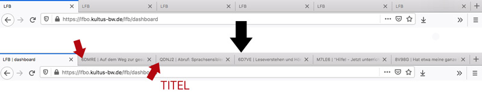
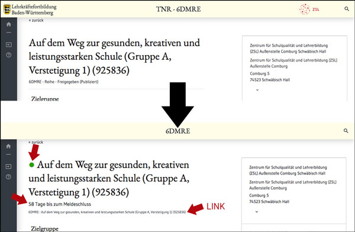

## LFB+
v1.5

Verbessert die Darstellung der Seiten zur Suche und die der Einzeldarstellung einer Fortbildung auf [https://lfbo.kultus-bw.de/lfb](https://lfbo.kultus-bw.de/lfb) - umgangsprachlich auch LFB genannt.

#### Lokale Änderungen an den LFB-Seiten
- _Suchseite_: Es werden Hyperlinks ergänzt, die die Fortbildung (direkt) in einem neuen Tab öffnen.

- _Einzelseite_: Auf der Seite der einzelnen Fortbildung wird das Meldeschluss-Datum ausgelesen und grafisch im oberen Teil direkt visualisert; grün: melden noch möglich, orange: melden möglich, aber zügig, rot: Meldeschluss vorbei, schwarz: kein Meldeschluss gefunden (z.B. bei einer Fortbildungsreihe Reihe).

- _Einzelseite_: Es wird anhand des Titels der Fortbildung und der LFB-ID ein zusammenfassender Link gesetzt, den man leichter kopieren kann, um ihn z.B. an Interessierte weiterzusenden.

- _Einzelseite_: Im Titel des Tabs steht statt _LFB_ nun der Titel und die LFB-ID. Dadurch wird das Ablegen in der Lesezeichenleiste übersichtlicher.

#### Installation als Addon
* für Firefox [hier](https://addons.mozilla.org/en-US/firefox/addon/lfb/) erhältlich
* als GreaseMonkey- oder TamperMonkey-Script (dazu ist sind die einzelnen Addons nötig: [Mozilla Firefox GM](https://addons.mozilla.org/de/firefox/addon/greasemonkey/), [Mozilla Firefox TM](https://addons.mozilla.org/de/firefox/addon/tampermonkey/?utm_source=addons.mozilla.org&utm_medium=referral&utm_content=search), [Google Chrome](https://chrome.google.com/webstore/detail/tampermonkey/dhdgffkkebhmkfjojejmpbldmpobfkfo?hl=de))

_Hinweis_:
Das ist ein privates Projekt; ich stehe bzgl. dieses Projektes _nicht_ in Kontakt mit dem ZSL oder dem KM

#### Screenshots

___

___

