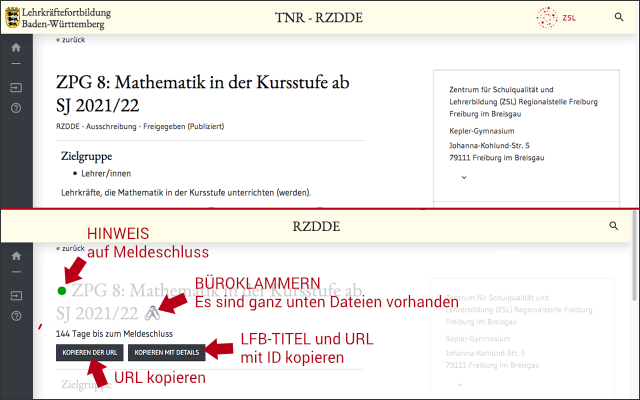

# LFB+
  

## Inhalt
Verbessert die Darstellung der Seiten zur Suche und die der Einzeldarstellung einer Fortbildung auf [https://lfbo.kultus-bw.de/lfb](https://lfbo.kultus-bw.de/lfb); umgangsprachlich auch LFB genannt.

Hinweis: Das ist ein privates Projekt; ich stehe bzgl. dieses Projektes _nicht_ in Kontakt mit dem ZSL oder dem KM.

## Änderungen an den LFB-Seiten
- **Seitenansicht zum Suchen von Fortbildungen**:
    - Es werden Hyperlinks ergänzt, die die Fortbildung (direkt) mit einem Klick in einem neuen Tab öffnen.
- **Seite einer einzelnen Fortbildung**:
    - Es werden anhand des Titels der Fortbildung und der LFB-ID zwei Buttons gesetzt. Damit ist das Kopieren und Weitersagen leichter und schneller.
    - Im Titel des Tabs steht statt _LFB_ nun die LFB-ID gefolgt vom Titel. Dadurch wird die Suche und das Abspeichern in der Lesezeichenleiste übersichtlicher.
    - Auf der Seite der einzelnen Fortbildung wird das Meldeschluss-Datum ausgelesen und grafisch im oberen Teil direkt visualisert (s. Tabelle).

    Graphische Hervorherbungen haben jeweils folgende Bedeutung:

    | grün                | organge       | rot                                     | schwarz                     |
    |-------------------- |-------------- |---------------------------------------  |---------------------------- |
    | Melden gut möglich  | zügig Melden  | Meldeschluss vorbei                     | kein Meldeschluss gefunden z.B. bei Reihen, Abruf etc.   |

## Installationshinweise
- für Firefox als Addon [hier](https://addons.mozilla.org/en-US/firefox/addon/lfb/) erhältlich; bitte ausschließlich von der offiziellen Mozilla-Addon-Seite laden.
- für Chrome als Addon [hier](https://chrome.google.com/webstore/detail/lfb%2B/bfmkdejboikhkccmdpdaojchaeojgnam) erhältlich
- als GreaseMonkey- oder TamperMonkey-Script: Dazu ist eines der folgenden Addons nötig, um das Script nutzen zu können: [Mozilla Firefox GM](https://addons.mozilla.org/de/firefox/addon/greasemonkey/), [Mozilla Firefox TM](https://addons.mozilla.org/de/firefox/addon/tampermonkey/?utm_source=addons.mozilla.org&utm_medium=referral&utm_content=search), [Google Chrome](https://chrome.google.com/webstore/detail/tampermonkey/dhdgffkkebhmkfjojejmpbldmpobfkfo?hl=de). Diese Addons helfen dabei, ein JavaScript lokal im Browser ausführen zu können. Das Script von hier downloaden oder kopieren und entweder im Addon-Dialog importieren oder manuell über Copy&Paste via _neues Benutzerscript_ ergänzen (mMn einfachste Möglichkeit). Wichtig: auf diese Weise werden werden _keinerlei_ Updates geladen.

## Lizenz
Creative Commons Attribution-NonCommercial 4.0 International [(CC BY-NC 4.0) ](https://creativecommons.org/licenses/by-nc/4.0/)

## Screenshots

